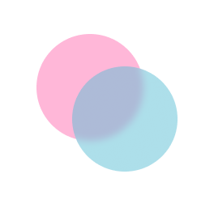
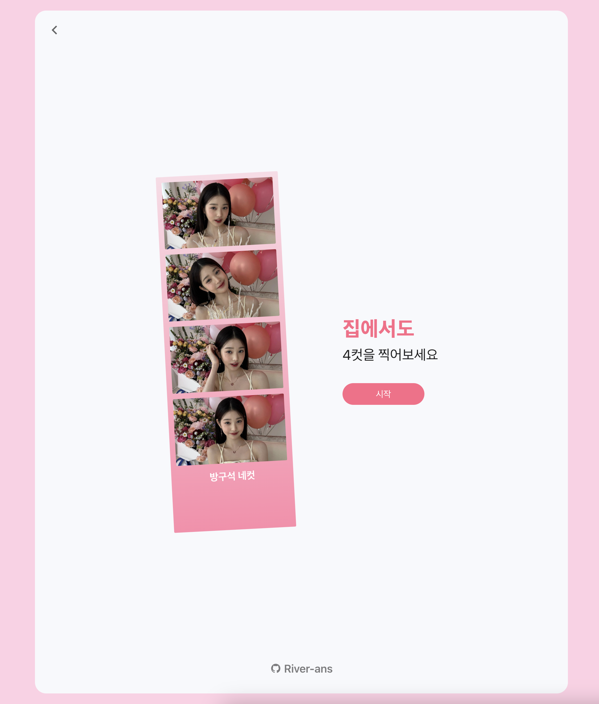

<h1 style="display: flex; justify-content: center; align-items: center;" >방구석 네컷</h1>
<div style="display: flex; justify-content: center; align-items: center; height:90vh;">

</div>

## 프로젝트 소개 및 목적

'방구석 네컷'은 테마를 선택할수 있고 웹캠을 이용해 4개의 연속된 사진을 찍고 네컷을 저장할 수 있는 웹 애플리케이션입니다. 사진부스에서 찍는 것 같은 느낌의 사진을 간단하게 찍을 수 있습니다.

> ### 이 프로젝트는 초기 단계에 있으며, 저는 개발 초보고 기능구현 빨리하기 위해서 몇가지 한계가 있습니다. 지속적인 업데이트를 통해 이러한 문제점을 개선할 예정입니다.
>
> - 웹캠을 기준으로 개발되었기 때문에, 모바일 환경에는 아직 최적화되지 않았습니다.
> - 리액트에 대한 지식이 아직 초보 수준이라 코드가 다소 불필요하게 복잡할 수 있습니다.
> - 웹 접근성에 대한 고려가 부족하여, 향후 개선이 필요합니다.

## 사용 방법

1. 웹사이트에 접속합니다. 시작버튼을 눌러 테마를 선택합니다.
2. '사진 찍기' 버튼을 눌러 사진을 찍습니다.
3. 3초지연 으로 연속 4장 사진을 찍습니다.
   - 3초 지연 카운트가 표시됩니다.
   - 현재 몇번째 찍고 있는지 화면에 표시됩니다.
4. 4장을 다 찍으면 선택된 테마대로 네컷사진이 생성되고 화면에 표시됩니다.
5. '다운로드' 버튼을 눌러 사진을 저장할수 있습니다.

## 설치 및 설정 가이드

필요한 것:

- Node.js
- Yarn or npm

설치:

```bash
git clone git@github.com:River-ans/FourCut-project.git
cd fourcut-project
npm install
```

실행

```bash
npm run dev
```

## 프로그래밍 언어, 라이브러리


  


## Roadmap or Future Improvements

- Real-Time 필터: 다양한 필터 옵션을 추가할 예정입니다.
- 다국어 언어 지원: 여러 언어를 지원할 예정입니다.
- 퍼포먼스: 더 빠른 로딩과 이미지 처리를 위한 성능 개선을 진행할 예정입니다.
- 테마 확장: 다양한 사용자 취향에 맞는 추가 테마를 계획 중입니다.
- 사진 텍스트 edit: 네컷 사진의 아래 텍스트 부분을 작성할수 있는 기능을 추가할 예정입니다.
- 다크 모드: 사용자 인터페이스에 다크 모드를 적용하여 눈의 피로를 줄이는 작업을 진행할 예정입니다.
- 접근성 개선: 웹 접근성 가이드라인을 따르기 위해 UI와 UX를 개선할 계획입니다.
- 코드 리팩토링 및 정리: 코드의 가독성과 유지 보수성을 높이기 위해 지속적인 리팩토링을 계획하고 있습니다.
- pwa: 향후 PWA(Progressive Web App)로 업그레이드할 예정입니다.

## 라이선스

이 프로젝트는 MIT 라이선스 하에 있습니다.

## 개발자 정보

<a href='https://github.com/River-ans'><svg role="img" viewBox="0 0 24 24" xmlns="http://www.w3.org/2000/svg" width="20" height="20"><path fill="#ffffff" d="M12 .297c-6.63 0-12 5.373-12 12 0 5.303 3.438 9.8 8.205 11.385.6.113.82-.258.82-.577 0-.285-.01-1.04-.015-2.04-3.338.724-4.042-1.61-4.042-1.61C4.422 18.07 3.633 17.7 3.633 17.7c-1.087-.744.084-.729.084-.729 1.205.084 1.838 1.236 1.838 1.236 1.07 1.835 2.809 1.305 3.495.998.108-.776.417-1.305.76-1.605-2.665-.3-5.466-1.332-5.466-5.93 0-1.31.465-2.38 1.235-3.22-.135-.303-.54-1.523.105-3.176 0 0 1.005-.322 3.3 1.23.96-.267 1.98-.399 3-.405 1.02.006 2.04.138 3 .405 2.28-1.552 3.285-1.23 3.285-1.23.645 1.653.24 2.873.12 3.176.765.84 1.23 1.91 1.23 3.22 0 4.61-2.805 5.625-5.475 5.92.42.36.81 1.096.81 2.22 0 1.606-.015 2.896-.015 3.286 0 .315.21.69.825.57C20.565 22.092 24 17.592 24 12.297c0-6.627-5.373-12-12-12"/></svg></a>

## 기여 방법

이슈를 열거나 기존 이슈에 참여하세요.<br/>
Fork한 뒤에 새로운 브랜치를 만들어 주세요.<br>
변경 사항을 커밋하고 Pull Request를 열어주세요.

## 문의

이메일: mriveroom@gmail.com <br>
